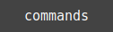
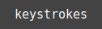

 

  
  
  
  
  
  

 
 

 
 

A simple, but still beautiful **Terminal Emulator**.
I would like to have my own personal website but in a different way. Usually my creativity does not let me copy from others.
Also I am a big fan of using **keyboard** and **Terminal**. And here is the result, an web-app with pure `JavaScript`, `HTML` and `CSS` and `SVG`.

 
 

<h1 id="commands" align="center">commands</h1>

  &#9898; <a href="https://k-five.github.io/red-cursor/">view</a>
  &#9899; commands
  &#9898; <a href="#keystrokes">keystrokes</a>
  &#9898; <a href="#thanks">thanks</a>
  &#9898; <a href="#bottom">bottom</a>
  &#9898; <a href="#top">top</a>

 
 

<table>
    <tr>
      <th>Name</th>
      <th>Argument</th>
      <th>Description</th>
    </tr>
    <tr>
      <td>ls</td>
      <td>Yes</td>
      <td>list files and directories</td>
    </tr>
    <tr>
      <td>cd</td>
      <td>No</td>
      <td>navigation between directories</td>
    </tr>
    <tr>
      <td>bc</td>
      <td>Yes</td>
      <td>set/reset background color</td>
    </tr>
    <tr>
      <td>fs</td>
      <td>Yes</td>
      <td>set/reset font size</td>
    </tr>
    <tr>
      <td>df</td>
      <td>No</td>
      <td>dummy file-system report</td>
    </tr>
    <tr>
      <td>ii</td>
      <td>No</td>
      <td>Internet of Iran</td>
    </tr>
    <tr>
      <td>cat</td>
      <td>Yes</td>
      <td>read the contents of a file</td>
    </tr>
    <tr>
      <td>pwd</td>
      <td>No</td>
      <td>print current path</td>
    </tr>
    <tr>
      <td>echo</td>
      <td>Yes</td>
      <td>echos its arguments</td>
    </tr>
    <tr>
      <td>date</td>
      <td>No</td>
      <td>print date in GMT</td>
    </tr>
    <tr>
      <td>help</td>
      <td>No</td>
      <td>print (this) help</td>
    </tr>
    <tr>
      <td>open</td>
      <td>Yes</td>
      <td>open a media</td>
    </tr>
    <tr>
      <td>clean</td>
      <td>No</td>
      <td>clear the screen</td>
    </tr>
    <tr>
      <td>history</td>
      <td>No</td>
      <td>print all entered commands</td>
    </tr>
</table>

 
 

<h1 id="keystrokes" align="center">keystrokes</h1>

  &#9898; <a href="https://k-five.github.io/red-cursor/">view</a>
  &#9898; <a href="#commands">commands</a>
  &#9899; keystrokes
  &#9898; <a href="#thanks">thanks</a>
  &#9898; <a href="#bottom">bottom</a>
  &#9898; <a href="#top">top</a>

 - Tab completion  
 - Cursor movement  
   - Home  
   - End  
   - Left-arrow  
   - Right-arrow  
 - History Navigation  
   - Up-arrow  
   - Down-arrow  
 - Modify line  
   - Backspace  
   - Delete  
 - Special Key  
   - Alt  
   - Ctrl  
   - Shift  

 
 

<h1 id="thanks" align="center">thanks</h1>

  &#9898; <a href="https://k-five.github.io/red-cursor/">view</a>
  &#9898; <a href="#commands">commands</a>
  &#9898; <a href="#keystrokes">keystrokes</a>
  &#9899; thanks
  &#9898; <a href="#bottom">bottom</a>
  &#9898; <a href="#top">top</a>

I deeply appreciate  
 1. [tutorialspoint](https://www.tutorialspoint.com/) for its simple-to-learn e-books.  
 2. [w3schools](https://www.w3schools.com/) for its short-and-sweet examples.  
 3. [MDN web doc](https://developer.mozilla.org/en-US/) for its good documentation and examples.  

 
 

<h1 id="license" align="center">license</h1>

  &#9898; <a href="https://k-five.github.io/red-cursor/">view</a>
  &#9898; <a href="#commands">commands</a>
  &#9898; <a href="#keystrokes">keystrokes</a>
  &#9898; <a href="#thanks">thanks</a>
  &#9899; bottom
  &#9898; <a href="#top">top</a>

  red-cursor copyright &copy; 2017 Shakiba
   
   
  ▒█▀▄▀█ ▀█▀ ▀▀█▀▀ 
  ▒█▒█▒█ ▒█░ ░▒█░░ 
  ▒█░░▒█ ▄█▄ ░▒█░░ 

